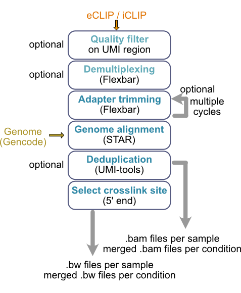

.. racoon_clip documentation master file, created by
   sphinx-quickstart on Wed Aug 23 12:29:06 2023.
   You can adapt this file completely to your liking, but it should at least
   contain the root `toctree` directive.

Welcome to racoon_clip's documentation!
=======================================

.. toctree::
   :maxdepth: 2
   :caption: Contents:

   installation
   tutorial 
   all_options
   methods_description

.. note::

   This project is under active development.

racoon_clip - What is it?
=========================

racoon_clip processes your iCLIP and eCLIP data from raw files to single-nucleotide crosslinks in a single step. It is an automatition of the iCLIP pipeline pubished by Busch *et al.* 2020 (`iCLIP data analysis: A complete pipeline from sequencing reads to RBP binding sites <https://doi.org/10.1016/j.ymeth.2019.11.008>`_). making the same processing now availabe for both iCLIP and eCLIP data in a highly reproducible manner. 

The performed steps are an optional quality filter, optional demultiplaexing, adapter trimming, genome alignment, optional deduplication and selection of single nucleotide crosslinks. For details on the performed steps please see :ref:`Detailed description of steps performed by racoon`.

Usage
=========================
                                                                                                                                                                                                                                                                                   
Once installed you can run racoon with

                                                                                                      
   racoon --cores [number_of_cores] --configfile [/path/to/config/file.yaml]

                                                                                                                                                              

Requirements
================

xx

Citations
=================

xx

Indices and tables
==================

* :ref:`genindex`
* :ref:`modindex`
* :ref:`search`

