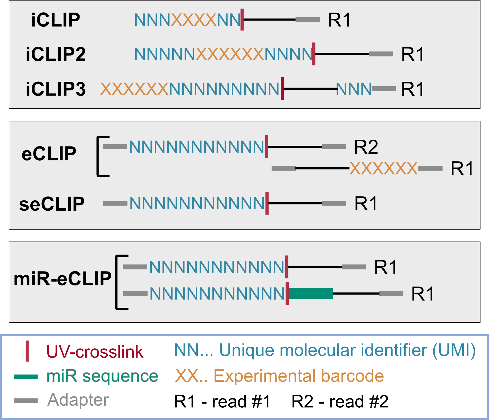

.. racoon_clip documentation master file, created by
   sphinx-quickstart on Wed Aug 23 12:29:06 2023.
   You can adapt this file completely to your liking, but it should at least
   contain the root `toctree` directive.

Welcome to racoon_clip's documentation!
=======================================

.. toctree::
   :maxdepth: 1
   :caption: Contents:

   installation
   tutorial 
   tutorial_customise
   tutorial_mir
   all_options
   examples
   methods_description

What is racoon_clip?
=========================

racoon_clip processes your iCLIP and eCLIP data from raw files to single-nucleotide crosslinks in a single step. It is an automation of the iCLIP pipeline published by Busch *et al.* 2020 (`iCLIP data analysis: A complete pipeline from sequencing reads to RBP binding sites <https://doi.org/10.1016/j.ymeth.2019.11.008>`_) making the same processing now available for both iCLIP and eCLIP data in a highly reproducible manner. 

The performed steps are a quality filter (optional), demultiplexing (optional), adapter trimming, genome alignment,  deduplication (optional) and selection of single nucleotide crosslinks. For details on the performed steps please see :ref:`Detailed description of steps performed by racoon`.

**Schema of workflow:**

.. figure:: ../Workflow.png
   :width: 500

Supported CLIP experiments
==============================

- iCLIP, iCLIP2, iCLIP3
- eCLIP, seCLIP
- miR-eCLIP
- custom set-ups for other CLIP experiments based on read-stops

**Set-up of reads, obtained from different types of CLIP experiments:**

Usage
=========================
                                                                                                                                                                                                                                                                            
racoon_clip consists of two main commands:

.. code:: bash

   racoon_clip crosslinks --cores <number_of_cores> --configfile </path/to/config/file.yaml>
   racoon_clip peaks --cores <number_of_cores> --configfile </path/to/config/file.yaml>

Use `crosslinks` for crosslink identification and `peaks` for peak calling. Check the tutorial to find out what needs to be in your config.yaml file.
                                                                                                                                                            

Requirements
================

- Docker / Singularity / Apptainer
or
- python =3.9.0
- mamba >= 1.3.1

Citations
=================

- Klostermann & Zarnack 2024 -- `racoon_clip—a complete pipeline for single-nucleotide analyses of iCLIP and eCLIP data <https://doi.org/10.1093/bioadv/vbae084>`_

- Busch *et al.* 2020 -- `iCLIP data analysis: A complete pipeline from sequencing reads to RBP binding sites <https://doi.org/10.1016/j.ymeth.2019.11.008>`_

- Huppertz *et al.* 2014 -- `iCLIP: protein-RNA interactions at nucleotide resolution <https://pubmed.ncbi.nlm.nih.gov/24184352/>`_

Indices and tables
==================

* :ref:`genindex`
* :ref:`modindex`
* :ref:`search`

