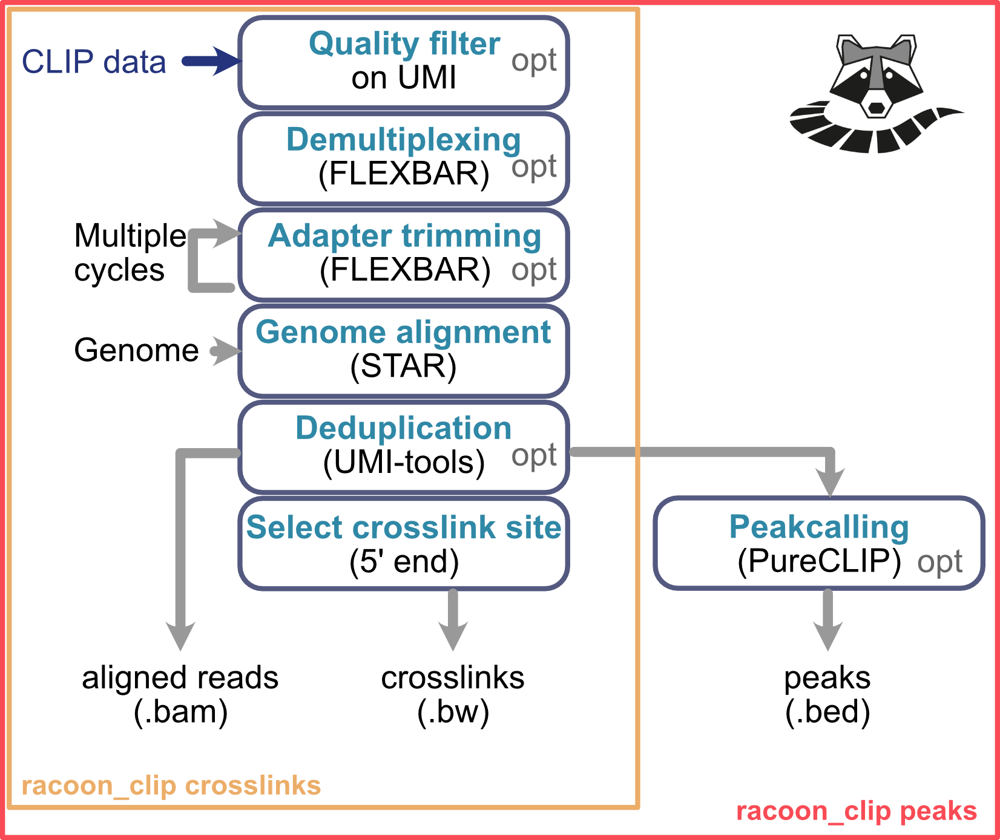

racoon_clip documentation
=========================

racoon_clip is a Snakemake-powered workflow for processing iCLIP, eCLIP,
seCLIP, and miR-eCLIP data from sequencing reads to single-nucleotide
crosslinks. The ``peaks`` workflow can additionally call group-level binding
sites with PureCLIP.

Choose a starting point
-----------------------

New users should begin with :doc:`installation` and :doc:`tutorial`. The
:doc:`examples` page provides experiment-specific walkthroughs using the
small datasets distributed with the repository.

Users preparing a new experiment should read :doc:`tutorial_customise`.
Complete option and output descriptions are kept separately in
:doc:`all_options` and :doc:`tutorial_output`.

Main commands
-------------

``crosslinks``
   Run preprocessing, alignment, optional deduplication, and crosslink
   identification.

``peaks``
   Run the crosslink workflow and then call peaks for each resolved experiment
   group.

``run``
   Deprecated compatibility alias for ``crosslinks``. See :doc:`updates`.

Supported experiments
---------------------

- iCLIP, iCLIP2, and iCLIP3
- eCLIP and seCLIP
- miR-eCLIP
- custom read-stop CLIP designs

   Main processing stages in racoon_clip.

Documentation
-------------

.. toctree::
   :maxdepth: 1
   :caption: Getting started

   installation
   tutorial
   examples

.. toctree::
   :maxdepth: 1
   :caption: Workflow guides

   tutorial_customise
   sample_groups
   tutorial_mir
   tutorial_container
   cluster_execution

.. toctree::
   :maxdepth: 1
   :caption: Reference

   all_options
   tutorial_output
   methods_description

.. toctree::
   :maxdepth: 1
   :caption: Help and project information

   troubleshooting
   updates
   citations

