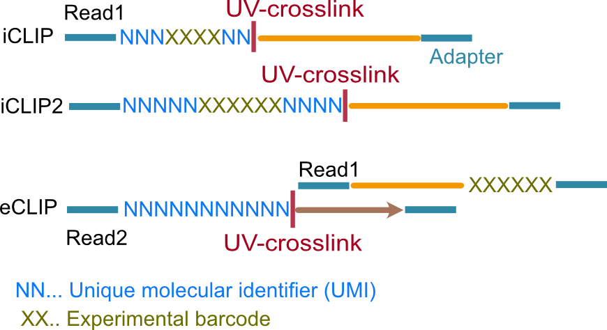

Tutorial: Quickstart
================================

.. contents:: 
    :depth: 2

How to run racoon_clip
---------------------------

You can run racoon_clip with the following commands:

.. code:: commandline

   racoon_clip crosslinks --configfile <your_configfile.yaml> --cores <n_cores> [OPTIONS]
   racoon_clip peaks --configfile <your_configfile.yaml> --cores <n_cores> [OPTIONS]

The `crosslinks` command performs the crosslink identification pipeline, while the `peaks` command performs both crosslink identification and peak calling.

What you need to specify in the config file
---------------------------

The config file is a .yaml file that contains all the information about your data. The following input is required from the user:

- infiles
- samples
- genome_fasta
- gtf
- either experiment_type or specific UMI and barcode length (umi1_len, umi2_len, encode_umi_length, total_barcode_len, barcodeLength)
- read_length
- in some cases a barcode fasta (for the demultiplexing functionality or for data with an iCLIP, iCLIP2, or iCLIP3 barcode included)

.. Note::

  All paths need to be specified as absolute paths. Relative paths` (for example starting with ~) are not allowed.

A minimal config file would therefore look like this:

.. code:: python
    
    # where to put results
    wdir: "output/path" # no backslash in the end of the path
    # input
    infiles: "path/to/sample1.fastq path/to/sample2.fastq" # one un-demultiplexed file or multiple demultiplexed files
    samples: "sample1 sample2"
    # annotation
    gtf: "path/to/annotation.gtf" # has to be unzipped at the moment
    genome_fasta: "path/to/genome_assembly.fa" # has to be unzipped or bgzip
    star_index: "" # optional prebuilt STAR index directory
    read_length: N 

    # experiemnt type
    experiment_type: "iCLIP"/"iCLIP2"/"iCLIP3"/"eCLIP_5ntUMI"/"eCLIP_10ntUMI"/"eCLIP_ENCODE_5ntUMI"/"eCLIP_ENCODE_10ntUMI"/"noBarcode_noUMI"/"other" 

    # for the demultiplexing functionality or for data with experiment_type "iCLIP", "iCLIP2", or "iCLIP3"
    barcodes_fasta: "path/to/barcodes.fasta" # barcodes need to have the same names as specified in the samples parameter above

What is my experiement_type?
--------------------------
The experiment_type specifies the barcode and adapter setup in your data. You can choose from the following options, or use a custom setup.

- **iCLIP**: two UMI parts (3nt and 2nt) interspaced by the experimental barcode (4nt)

- **iCLIP2**: two UMI parts (5nt and 4nt) interspaced by the experimental barcode (6nt)

- **iCLIP3**: UMI of 9nt (at the 5' end)

- **eCLIP** UMI of 10nt or 5nt in the beginning (5' end) of read2. Specify "eCLIP_10ntUMI" or "eCLIP_10ntUMI". 

- **eCLIP from ENCODE:** UMI of 10nt or 5nt in the beginning (5' end) of read2 is already trimmed off and stored in the read name. Specify "eCLIP_ENCODE_5ntUMI" or "eCLIP_ENCODE_10ntUMI".

- **UMI and barcode are already trimmed off**: If your data does not contain the UMI and barcode information anymore choose "noBarcode_noUMI" irrespective of what experiment the data is from. This is often the case for files downloaded from SRA.

    Most common barcode setups.

Which steps will racoon_clip crosslinks run by default?
---------------------------
This depends on the experiment_type. If not specified otherwise, racoon_clip crosslinks will run the following:

| **iCLIP, iCLIP2, and other:** 
| Quality Control > Barcode and Adapter trimming > Alignment > Deduplication > Crosslink detection
|
| **eCLIP_5ntUMI, eCLIP_10ntUMI and iCLIP3:** 
| Quality Control > UMI and Adapter trimming > Alignment > Deduplication > Crosslink detection

The `racoon_clip peaks` command performs crosslink identification and subsequent peak calling. 
|
| **eCLIP_ENCODE_5ntUMI and eCLIP_ENCODE_10ntUMI:** 
| Adapter trimming > Alignment > Deduplication > Crosslink detection
|
| **noBarcode_noUMI:**
| Adapter trimming > Alignment > Crosslink detection

How to turn optional steps on or off
--------------------------------------
You can use the following parameters to turn steps on or off:

.. code:: python

    demultiplex: True/False
    quality_filter_barcodes: True/False
    adapter_trimming: True/False
    deduplicate: True/False

Demultiplexing 
^^^^^^^^^^^^^^^^^
Demultiplexing is currently only possible for single-end read data. Both the UMI and the barcode need to be positioned at the beginning of the read.

- **demultiplex** (True/False): *default False*; Whether demultiplexing still has to be done.
- **barcodes_fasta** (path to fasta): Path to fasta file of antisense sequences of the used barcodes. Not needed if data is already demultiplexed. UMI sequences should be added as N. 

This is an example of a barcode fasta for an iCLIP experiment. It is important that the barcode names (after >) are exactly the same as the specified sample names and the names of the input read files. The UMIs are added as Ns.

.. code-block:: text

   >min_expamle_iCLIP_s1
   NNNGGTTNN
   >min_expamle_iCLIP_s2
   NNNGGCGNN

Quality filtering during barcode trimming
^^^^^^^^^^^^^^^^^^^^^^^^^^^^^^^^^^^^^^^^

- **flexbar_minReadLength** (int): *default 15*; The minimum length a read should have after trimming of barcodes, adapters and UMIs. Shorter reads are removed.

- **quality_filter_barcodes** (True/False): *default True*; Whether reads should be filtered for a minimum sequencing quality in the barcode sequence. 

- **minBaseQuality** (int): *default 10*; The minimum per-base quality of the barcode region of each read. Reads below this threshold are filtered out. This only applies if quality_filter_barcodes is set to True. 

Adapters
^^^^^^^^^^
- **adapter_trimming** (True/False): *default True*; Whether adapter trimming should be performed. 

- **adapter_file** (path): *default /params.dir/adapters.fa*; A fasta file of adapters that should be trimmed. The default file contains the Illumina Universal adapter, the Illumina Multiplexing adapter and 20 eCLIP adapters. 

- **adapter_cycles** (int): *default 1*; How many cycles of adapter trimming should be performed. We recommend using 1 for iCLIP and iCLIP2 data and 2 for eCLIP.

Deduplication
^^^^^^^^^^^^^^
- **deduplicate** (True/False): *default True*; Whether to perform deduplication. It is recommended always to use deduplication unless no UMIs are present in the data.

How to customise racoon_clips behaviour
------------------

Check out how to customise racoon_clip  :ref:`here <tutorial>`. 

