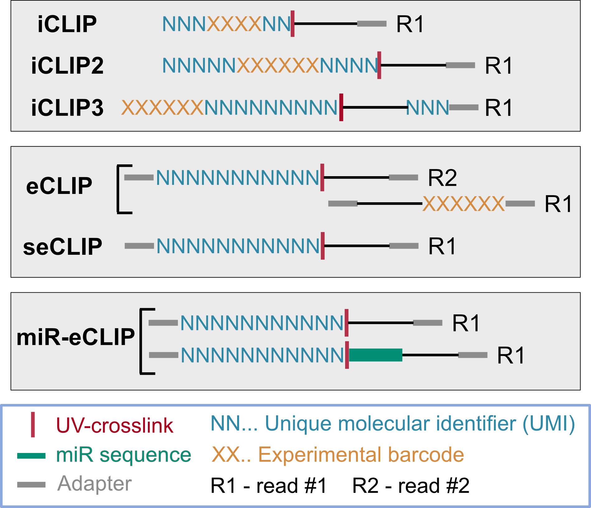

.. _tutorial_customise:

Configuration and experiment types
==================================

acoon_clip accepts workflow settings from a YAML configuration file and from
command-line options. Configuration keys are case-sensitive and retain their
exact spelling, including underscores and capitalization. Command-line option
names use ``-`` instead of ``_`` in the parameters; use ``racoon_clip crosslinks --help`` or
``racoon_clip peaks --help`` to see the accepted options.

A configuration file only needs to contain the required inputs and settings
that differ from the defaults. Use absolute paths for input, reference, and
output files.

.. code-block:: yaml

   wdir: /absolute/path/to/output

   infiles: "/absolute/path/to/sample1.fastq.gz /absolute/path/to/sample2.fastq.gz"
   experiment_type: iCLIP2

   genome_fasta: /absolute/path/to/genome.fa
   gtf: /absolute/path/to/annotation.gtf
   read_length: 75

When ``demultiplex`` is false, sample names can be inferred by removing the
``.fastq``, ``.fq``, ``.fastq.gz``, or ``.fq.gz`` suffix from each input
filename. When ``demultiplex`` is true, ``samples`` and ``barcodes_fasta``
must be specified.

The complete parameter and default-value reference is :doc:`all_options`.

Experiment presets
------------------

The ``experiment_type`` setting applies a predefined barcode and UMI
arrangement. Supported values are:

- ``iCLIP``
- ``iCLIP2``
- ``iCLIP3``
- ``eCLIP_5ntUMI``
- ``eCLIP_10ntUMI``
- ``eCLIP_ENCODE_5ntUMI``
- ``eCLIP_ENCODE_10ntUMI``
- ``miReCLIP``
- ``noBarcode_noUMI``
- ``other``

..note 

   - For seCLIP use an ``eCLIP`` experiment_type.
   - Use an ``ENCODE`` preset when the UMI has already been removed from the read and stored in its name. 
   - Use ``noBarcode_noUMI`` when neither barcode nor UMI sequence remains. 
   - Use ``other`` when defining the barcode and UMI arrangement manually.

   Common barcode and UMI arrangements.

Samples and groups
------------------

``samples`` identifies the reads processed as separate samples. 
``experiment_group_file`` and ``experiment_groups`` control group-level
merging and peak calling. See :doc:`sample_groups` for the assignment format
and validation behavior.

Optional processing stages
--------------------------

``quality_filter_barcodes``
   Filter reads using sequencing quality in the barcode or UMI region.

``demultiplex``
   Split one multiplexed input according to ``barcodes_fasta``.

``adapter_trimming``
   Trim adapters with FLEXBAR. ``adapter_cycles`` controls repeated trimming.

``trim3``
   Trim a configured number of bases from the 3-prime end. This is enabled
   automatically for the iCLIP3 preset.

``deduplicate``
   Deduplicate aligned reads by UMI. The no-barcode/no-UMI preset disables
   UMI-based deduplication.

Alignment choices
-----------------

``genome_fasta`` supplies the reference sequence. A ``gtf`` annotation is
optional; without it, STAR aligns without annotated splice junctions.
``star_index`` can point to an existing STAR index. Otherwise, the workflow
builds an index for the run.

STAR tuning parameters include ``outFilterMismatchNoverReadLmax``,
``outFilterMismatchNmax``, ``outFilterMultimapNmax``,
``outReadsUnmapped``, ``outSJfilterReads``, and
``moreSTARParameters``. Consult the
`STAR manual <https://github.com/alexdobin/STAR/blob/master/doc/STARmanual.pdf>`_
before changing them.

Peak calling
------------

The ``peaks`` workflow runs PureCLIP after group BAM creation.
``morePureclipParameters`` passes additional PureCLIP options. Limiting model
training to representative chromosomes can reduce memory requirements for
large genomes.

.. code-block:: bash

   morePureclipParameters: "-iv 'chr1;chr2;chr3;'"

FastQ Screen
------------

The configuration keys ``fastqScreen`` and ``fastqScreen_config`` enable the
optional contamination-screening path. A readable FastQ Screen configuration
is required when the feature is enabled.

Execution environments
----------------------

For scheduler profiles and forwarded Snakemake arguments, see
:doc:`cluster_execution`. For bind mounts and in-container paths, see
:doc:`tutorial_container`.
