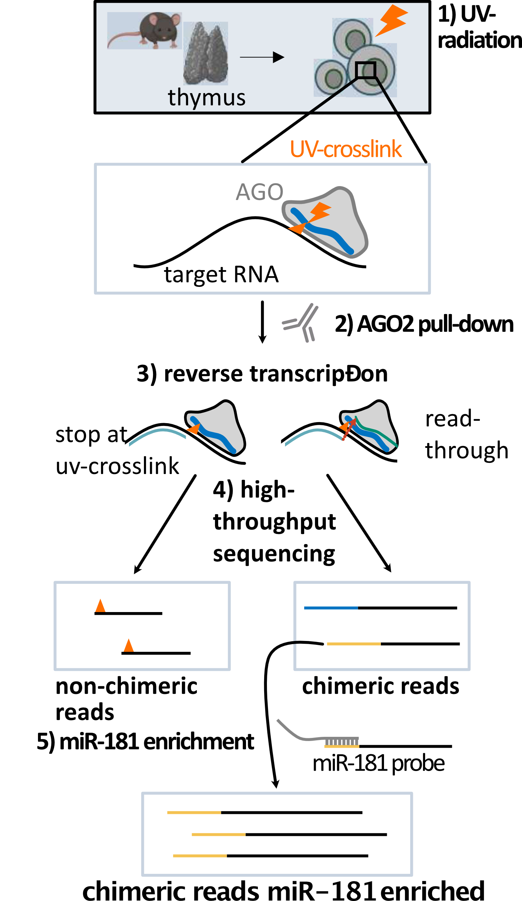
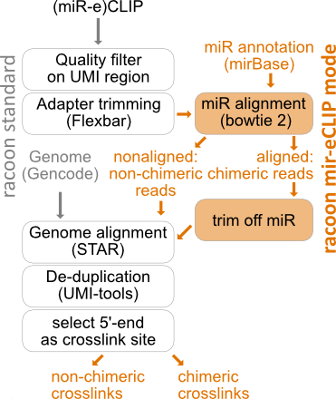

Tutorial: The miR-eCLIP module
================================

.. contents:: 
    :depth: 2

What is miR-eCLIP?
---------------------------

miR-eCLIP is a type of CLIP experiment that allows the mapping of microRNA binding sites on their target RNAs. 
During the experiment miRNA and target RNA  the reverse transcription step produces to a certain extent chimeric reads via read through. 
The chimeric reads consist of the miRNA sequence at the 5' end and the sequence of the target RNA next to the UV crosslink. 
A detailed description of the miR-eCLIP experiment can be found `here <https://doi.org/10.1101/2022.02.13.480296>`_. 

How to analyse miR-eCLIP data with racoon_clip
-----------------------------

racoon_clip includes an option to analyse miR-eCLIP data (see below for a detailed description of the steps performed). For this, the experiment type "miReCLIP" should be specified and a fasta file of all microRNAs must be provided (mir_genome_fasta).

In addition, one can allow different start positions for the miRNA in the chimeric reads, as we have observed that sometimes there are a few extra nucleotides between the end of the adapter and the miR start (mir_starts_allowed). 

All other parameters are the same as the normal racoon_clip parameters. 
Here is an example config file:

.. code:: python

    experiment_type: "miReCLIP"    
    
    # Where to put the results
    wdir: "output/path" # no backslash at the end of the path

    # Input
    infiles: "path/to/sample1.fastq path/to/sample2.fastq" # one un-demultiplexed file or multiple demultiplexed files

    # Samples
    samples: "sample1 sample2"

    # Annotation
    gtf: "path/to/annotation.gtf" # has to be unzipped at the moment
    genome_fasta: "path/to/genome_assembly.fa" # has to be unzipped or bgzip
    read_length: N 

    # Adapters
    adapter_cycles: 2
    
    # Chimeric miR
    mir_genome_fasta: "path/to/miR-genome.fasta" # for example from miRbase
    mir_starts_allowed: "0 1 2 3 4"

What are the output files?
---------------------------

You get the following output files:

- **Report_miR.html**: An html report, that with overall statistics on the obtained miRs.
- **mir_analysis/aligned_mir**: Contains the alignemnt of the miR part of the chimeric reads to the miR sequences as BAM files.
- **mir_analysis/aligned_chimeric_bam**: Contains the target RNA part of the chimeric reads aligned to the genome as BAM files.
- **mir_analysis/crosslinks**: Contains the crosslinks of the target RNAs in BW files and BED files. In the BED files the read anmes contain the name of the corresponding miR, that belongs to the read.

How does racoon_clip process miR-eCLIP data?
------------------------------------------

Quality filtering and Adapter trimming
^^^^^^^^^^^^^^^^^^^^^^^^^^^^^^^^^^^

First quality filtering and adapter trimming is performed on the raw data. A description of these steps can be found :ref:`here <methods_description>`. 

miR alignment
^^^^^^^^^^^^^^^^^^^^^^^^^^^^^^^^^^^
Filtered and trimmed reads are shortend to the first (5’) 24nt with fastx_trimmer -l 24 (from FASTX-Toolkit). For chimeric reads, these 24nt include the 21nt long miRNA. This is done to increase the alignability of the reads, as the long reads have sometimes caused problems when aligning to the annotation of the mature miRNA, which contains only short sequences.

The short reads are then aligned to the miR annotation using bowtie2 with the following settings: –local -D 20 -R 3 -L 10 -i S,1,0.50 -k 20 –trim5 2. Before building an index of the miR genome using bowtie2-build.

Obtaining separate fastq files of chimeric and non-chimeric reads
^^^^^^^^^^^^^^^^^^^^^^^^^^^^^^^^^^^
The reads in the obtained .sam file are then split into chimeric reads and non-chimeric reads by the sam-FLAG with samtools view -f 0 for chimeric reads and samtools view -f 4 for non-chimeric (unaligned) reads.

The read IDs of the unaligned reads are used to extract the non-chimeric reads from the quality filtered and trimmed fastq files with seqkit grep -n. The fastq files of the non-chimeric reads are then sorted with seqkit sort -n and afterwards aligned to the genome annotation as described in the main report.

The chimeric reads are further split by the position of their mapping start (4th column in the sam file). It is important to consider the mapping start, as not all miRs start at the first nucleotide of the read, but the crosslink position should be exactly 21nt after the first nucleotide of the miR. Awk on the sam files is used to make a list of read IDs for each mapping start, then the reads are extracted from the quality filtered and trimmed fastq files according to the mapping start with seqkit grep -n. In addition, the name of the miR (column 3 of the sam file) is extracted as a separate list with awk and added to the beginning of the read_id in the fastq files with seqkit replace -p ‘(.+)’ -r “{{kv}}”.

For each mapping start position, the long reads in the fastq files are trimmed with fastx-trimmer so that the first nt (5’) corresponds to the position where reverse transcription stopped, which is 1nt upstream of the UV crosslink.

After trimming, the fastq files of the chimeric reads are reassembled using cat. By default, reads with a mir start position of 1, 2, 3 or 4 are included and mapping starts at later positions are discarded. This can be changed (see configurations above).

Alignment of chimeric reads to genome annotation
^^^^^^^^^^^^^^^^^^^^^^^^^^^^^^^^^^^
The genome annotation is indexed using STAR –runMode genomeGenerate. The merged file of chimeric reads is then aligned to the genome annotation using STAR –runMode alignReads. For STAR settings, see Configurations. The resulting bam files are indexed using samtools index.

Deduplication
^^^^^^^^^^^^^^^^^^^^^^^^^^^^^^^^^^^
Chimeric reads are deduplicated in the same way as non-chimeric reads with umi_tools dedup –extract-umi-method read_id –method unique.

Obtaining chimeric crosslinks
^^^^^^^^^^^^^^^^^^^^^^^^^^^^^^^^^^^
The deduplicated bam files are then converted to bed files using bedtools bamtobed. The reads are shifted 1nt upstream (5’ direction) with bedtools shift -m 1 -p -1, because the UV crosslink should be positioned 1nt before the stop of the non-miR part of the read. Then the read ID (which now also contains the miR name) is truncated to the miR name using awk, the bed file is split into plus and minus strand and the reads are reduced to 1nt crosslinks again using awk.

To allow visualisation in a genome browser, the 1nt crosslink bed file is then also converted into a .bigWig file using bedGraphToBigWig. These bigWig files are then merged with bigWigMerge by the experiment groups specified by the user.

