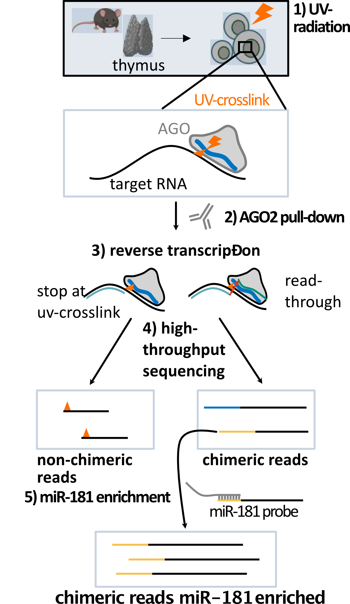
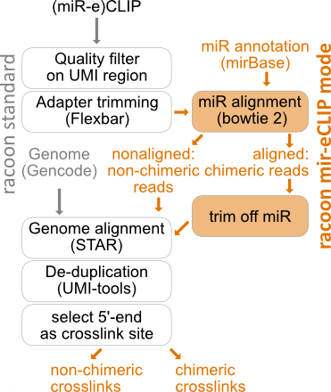

Tutorial: The miR-eCLIP module
==============================

.. contents:: 
    :depth: 2

What is miR-eCLIP?
------------------

miR-eCLIP is a type of CLIP experiment that allows the mapping of microRNA binding sites on their target RNAs. 
During the experiment miRNA and target RNA  the reverse transcription step produces to a certain extent chimeric reads via read through. 
The chimeric reads consist of the miRNA sequence at the 5' end and the sequence of the target RNA next to the UV crosslink. 
A detailed description of the miR-eCLIP experiment can be found `here <https://doi.org/10.1101/2022.02.13.480296>`_. 

How to analyse miR-eCLIP data with racoon_clip
----------------------------------------------

racoon_clip includes an option to analyse miR-eCLIP data (see below for a detailed description of the steps performed). For this, the experiment type "miReCLIP" should be specified and a fasta file of all microRNAs must be provided (mir_genome_fasta).

In addition, one can allow different inferred start positions for the canonical miRNA in the processed reads (mir_starts_allowed). The number of accepted missing nucleotides from the canonical miRNA 5' end is controlled separately with mir_5prime_missing_allowed.

All other parameters are the same as the normal racoon_clip parameters. 
Here is an example config file:

.. code:: yaml

    experiment_type: "miReCLIP"    
    
    # Where to put the results
    wdir: "output/path" # no backslash at the end of the path

    # Input
    infiles: "path/to/sample1.fastq path/to/sample2.fastq" # one un-demultiplexed file or multiple demultiplexed files

    # Samples
    samples: "sample1 sample2"

    # Annotation
    gtf: "path/to/annotation.gtf" # has to be unzipped at the moment
    genome_fasta: "path/to/genome_assembly.fa" # has to be unzipped or bgzip
    star_index: "" # optional prebuilt STAR index directory
    read_length: N 

    # Adapters
    adapter_cycles: 2
    
    # Chimeric miR
    mir_genome_fasta: "path/to/miR-genome.fasta" # for example from miRbase
    mir_starts_allowed: "1 2 3 4"
    mir_5prime_missing_allowed: "0 1 2 3"

What are the output files?
--------------------------

You get the following output files:

- **Report_miR.html**: An html report, that with overall statistics on the obtained miRs.
- **mir_analysis/aligned_mir**: Contains the alignemnt of the miR part of the chimeric reads to the miR sequences as BAM files.
- **mir_analysis/aligned_chimeric_bam**: Contains the target RNA part of the chimeric reads aligned to the genome as BAM files.
- **mir_analysis/crosslinks**: Contains the crosslinks of the target RNAs in BW files and BED files. In the BED files the read anmes contain the name of the corresponding miR, that belongs to the read.
- all other output files from the standard racoon_clip analysis

How does racoon_clip process miR-eCLIP data?
--------------------------------------------

Quality filtering and Adapter trimming
^^^^^^^^^^^^^^^^^^^^^^^^^^^^^^^^^^^^^^

First quality filtering and adapter trimming is performed on the raw data. A
description of these steps is available in :doc:`methods_description`.

miR alignment
^^^^^^^^^^^^^^^^^^^^^^^^^^^^^^^^^^^
Filtered and trimmed reads are shortend to the first (5’) 24nt with fastx_trimmer -l 24 (from FASTX-Toolkit). For chimeric reads, these 24 nt include the mature miRNA sequence. This is done to increase the alignability of the reads, as the long reads have sometimes caused problems when aligning to the annotation of the mature miRNA, which contains only short sequences.

The short reads are then aligned to the miR annotation using bowtie2 with the following settings: –local -D 20 -R 3 -L 10 -i S,1,0.50 -k 20 –norc –trim5 2. Before building an index of the miR genome using bowtie2-build.

Obtaining separate fastq files of chimeric and non-chimeric reads
^^^^^^^^^^^^^^^^^^^^^^^^^^^^^^^^^^^^^^^^^^^^^^^^^^^^^^^^^^^^^^^^^
The reads in the obtained .sam file are then split into chimeric reads and non-chimeric reads by the sam-FLAG with samtools view -F 4 for chimeric reads and samtools view -f 4 for non-chimeric (unaligned) reads.

The read IDs of the unaligned reads are used to extract the non-chimeric reads from the quality filtered and trimmed fastq files with seqkit grep -n. The fastq files of the non-chimeric reads are then sorted with seqkit sort -n and afterwards aligned to the genome annotation as described in the main report.

For each mapped read, racoon_clip infers where the canonical miRNA begins in the processed read. The calculation accounts for Bowtie2's two trimmed 5' bases, leading soft clipping in the CIGAR string, and the alignment start on the miRNA reference. mir_starts_allowed filters these inferred read positions.

The target-RNA start is calculated from the full canonical length of the aligned miRNA sequence in mir_genome_fasta. The mir_5prime_missing_allowed parameter controls how many missing bases from the canonical miRNA 5' end are accepted. Insertions and deletions are projected through the CIGAR string. The miRNA name is added to the read ID and the canonical miRNA portion is removed before genomic alignment.

Alignment of chimeric reads to genome annotation
^^^^^^^^^^^^^^^^^^^^^^^^^^^^^^^^^^^^^^^^^^^^^^^^
The genome annotation is indexed using STAR –runMode genomeGenerate. The merged file of chimeric reads is then aligned to the genome annotation using STAR –runMode alignReads. For STAR settings, see Configurations. The resulting bam files are indexed using samtools index.

Deduplication
^^^^^^^^^^^^^^^^^^^^^^^^^^^^^^^^^^^
Chimeric reads are deduplicated in the same way as non-chimeric reads with umi_tools dedup –extract-umi-method read_id –method unique.

Obtaining chimeric crosslinks
^^^^^^^^^^^^^^^^^^^^^^^^^^^^^^^^^^^
The deduplicated bam files are then converted to bed files using bedtools bamtobed. The reads are shifted 1nt upstream (5’ direction) with bedtools shift -m 1 -p -1, because the UV crosslink should be positioned 1nt before the stop of the non-miR part of the read. Then the read ID (which now also contains the miR name) is truncated to the miR name using awk, the BED file is split by strand, and the strand-aware 5' end is reduced to a one-nucleotide crosslink using the left edge on the plus strand and the right edge on the minus strand.

To allow visualisation in a genome browser, the 1nt crosslink bed file is then also converted into a .bigWig file using bedGraphToBigWig. These bigWig files are then merged with bigWigMerge by the experiment groups specified by the user.

