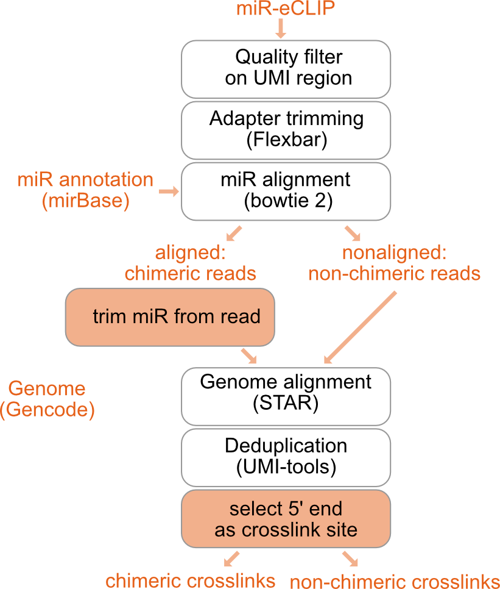

```{r setup, include=FALSE}
require("knitr")
knitr::opts_chunk$set(warning=FALSE, message=FALSE, cache=F, echo = F, cache.lazy = FALSE,  dpi= 20, fig.width = 20, fig.height = 10)


source("theme_html.R")
library(ggplot2)
theme_set(theme_html())

# require("knitr")
# knitr::opts_chunk$set(warning=FALSE, message=FALSE, cache=T, cache.lazy = FALSE,  dpi= 20, fig.width = 20, fig.height = 10, out.width="100%") 
# tidy.opts=list(width.cutoff=80,tidy=TRUE, echo=FALSE)
# 
# source("/Users/melinaklostermann/Documents/projects/R_general_functions/theme_paper.R")
# library(ggplot2)
# theme_set(theme_paper())


```

```{r libraries, include=FALSE}
library(dplyr)
library(purrr)
library(rtracklayer)
library(GenomicRanges)
library(kableExtra)
library(readr)
library(yaml)

```

# Configurations {.tabset}
```{r}
config <- yaml.load_file(params$config) %>% map_dfr(., ~.x) %>% t(.)
dir <- config["wdir",]
```


## Input files {-}
```{r}
print(paste("configfile:", params$config))

kable(config[c("infile", "indir", "barcodes_fasta", "gft", "genome_fasta", "miR_genome_fasta"),])  %>%
  kable_styling(bootstrap_options = c("striped", "hover"))
```

## Optional steps {-}
```{r}
kable(config[c("demuliplexing", "adapter_cycles", "quality_filter_barcodes"),])  %>%
  kable_styling(bootstrap_options = c("striped", "hover"))
```

## Barcode settings {-}
```{r}
kable(config[c("barcodeLength", "minBaseQuality", "umi1_len", "exp_barcode_len", "samples"),])  %>%
  kable_styling(bootstrap_options = c("striped", "hover"))
```

## Read filter {-}
```{r}
kable(config[c("flexbar_minReadLength"),])  %>%
  kable_styling(bootstrap_options = c("striped", "hover"))
```

## Alignment setting (STAR) {-}
```{r}
kable(config[c("sjdbOverhang", "outFilterMismatchNoverReadLmax", "outFilterMismatchNmax", "outFilterMultimapNmax", "alignEndsType",
               "outReadsUnmapped",  "outSJfilterReads"),])  %>%
  kable_styling(bootstrap_options = c("striped", "hover"))

```

## Experiment groups {-}
```{r}
groups <- read.table(config["experiment_group_file",])
colnames(groups) <- c("Group", "Sample")
groups

```

# Overview of performed steps




First quality filtering and adapter trimming are performed on the raw data. For a description of these steps please refer to the main report.


## miR alignment

Filtered and trimmed reads are shortend to the first (5') 24nt with fastx_trimmer -l 24 (from FASTX-Toolkit). In chimeric reads these 24nt contain the miRNA which is 21nt long. This is done to increase the alignability of the reads as the long reads were sometimes found to cause problems when aligning to the annotaion of mature miRNA, that only contains short sequences.

The short reads are then aligned to the miR annotation with bowtie2 with the following settings: --local -D 20 -R 3 -L 10 -i S,1,0.50 -k 20 --trim5 2. Before a index of the miR genome is created with bowtie2-build. 

## Get fastq files of chimeric and non-chimeric reads

The reads in the obtained .sam file are then split into chimeric reads and non-chimeric reads by the sam-FLAG with samtools view -f 0 for chimeric reads and samtools view -f 4 for non chimeric (unaligned) reads. 

The read IDs of the unaligned reads are used to extract the non-chimeric reads from the quality filtered and trimmed fastq files with seqkit grep -n. The fastq files of the non-chimeric reads are then sorted with seqkit sort -n and afterwards aligned to the genome annotation as discribed in the main report.

The chimeric reads are further split by the position of their mapping start (4th coulmn in sam file). It is important to consider the mapping start, as not all miRs start at the first nucleotide of the read, but the crosslink position should be positioned exactly 21nt after the first nucleotide of the miR. Awk on the sam files is used to make a list of read IDs for each mapping start, then the reads are extracted from the the quality filtered and trimmed fastq files acording to the mapping start with seqkit grep -n. Moreover the name of the miR (column 3 of sam file) is extracted as a separate list with awk and is added in the beginning of the read_id in the fastq files with seqkit replace -p '(.+)' -r "{{kv}}". 

For each mapping start position the long reads in the fastq files are accordingly with fastx-trimmer so the first nt (5') corresponds to the position where reverse transcription stopped, which is 1nt upstream of the UV-crosslink.

After the trimming the fastq files of the chimeric reads are again merged with cat. By default reads with a mir start position at 1, 2, 3 or 4 are considered and mapping starts at later positions are discarded. This can be changed (see configurations above).

## align chimeric reads to genome annotation

The genome annotation is indexed with STAR  --runMode genomeGenerate. Then the merged file of the chimeric reads is aligned to the genome annotation with STAR --runMode alignReads. For STAR settings see configurations. Obtained bam files are indexed with samtools index.


## deduplication

Chimeric reads are deduplicated analogous to the non-chimeric reads with umi_tools dedup --extract-umi-method read_id --method unique.

## obtaining chimeric crosslinks

The deduplicated bam files are then converted into bed files with bedtools bamtobed. The reads are shifted 1nt upstream (5' direction) with bedtools shift -m 1 -p -1 because the UV-crosslink should be positioned 1nt before the stop of the non-miR part of the read. Then the read ID (which now also contains the miR name) is shortend to the miR name with awk, the bed file ist split into plus and minus strand and the reads are reduced to 1nt crosslinks also in awk.

To allow visualization in a genome browser the 1nt crosslink bed file is then also converted to .bigWig file using bedGraphToBigWig. Furthermore these bigWig files are merged with bigWigMerge by the experiment groups, specified by the user.

# Resulting chimeric crosslinks

## Chimeric crosslinks per sample

These are the chimeric crosslinks, that we retrieve from each sample:

```{r read_crosslink_bed}

####################
# Input reads aufter QC
###################
fastqc_report_filtered <- read_delim(paste0(dir,"/results/fastqc/separate_samples/multiqc_data/multiqc_fastqc.txt"), delim="\t")

fastqc_report_filtered <- fastqc_report_filtered %>% arrange(Sample)

# fastqc_report_filtered <- fastqc_report_filtered[,c(1,5)] %>%
#   arrange(Sample)

#####################
# Aligment to miR
####################
# bowtie_numbers_non_chimeric <-  read_delim(paste0(dir,"/results/mir_analysis/aligned_mir/non_chimeric_bowtie_stats.txt"),
#                                            col_names = c("number", "Sample"))
# kable(bowtie_numbers_non_chimeric)

# bowtie_numbers_chimeric <-  read_delim(paste0(dir,"/results/mir_analysis/aligned_mir/chimeric_bowtie_stats.txt"),
#                                        col_names = c("reads_with_miR", "Sample"))
# kable(bowtie_numbers_chimeric)
# 
# 


#####################
# alignemt to genomic reads
####################
star_mir_out <-  list.files(path = paste0(dir,"/results/mir_analysis/aligned_chimeric_bam"), pattern = "*Log.final.out$", recursive = TRUE, full.names = T) %>% 
  map(., ~read_delim(.x, delim="\t", col_names = c("type", "number")))


star_mir_out_names <-  list.files(path = paste0(dir,"/results/mir_analysis/aligned_chimeric_bam"), pattern = "*Log.final.out$", recursive = TRUE) %>%
  stringr::str_remove(pattern = "chimeric_", . ) %>%
  stringr::str_remove(pattern = ".Log.final.out", . )


star_mir_out2 <- star_mir_out %>% map_dfr( ~ data.frame(reads_with_miR = .x[5,]$number,
                                                aligned_to_genome_perc = .x[9,]$number,
                                                aligned_to_genome_n = .x[8,]$number)
                                   )%>%
  mutate(., Sample = star_mir_out_names) %>% 
  arrange(Sample)


##################
# deduplication
#################
dedup_out <-  list.files(path = paste0(dir,"/results/mir_analysis/aligned_chimeric_bam"), pattern = "*out.duprm.log$", recursive = TRUE, full.names = T) %>%
  map(~read_delim(.x, delim="\t", skip = 57, col_names = c("invalue")) %>%
        mutate(measure = substr(invalue, 29, nchar(invalue)) %>% strsplit(., split = ":")) %>%
        rowwise() %>%
        mutate(type = measure[[1]],
               number = measure[[length(measure)]]) %>%
       .[(nrow(.)-5):(nrow(.)-2),]
      ) 

dedup_out_names <-  list.files(path = paste0(dir,"/results/mir_analysis/aligned_chimeric_bam"), pattern = "*out.duprm.log$", recursive = TRUE) %>%
  stringr::str_remove(pattern = "chimeric_", . ) %>%
  stringr::str_remove(pattern = ".Aligned.sortedByCoord.out.duprm.log", . )

dedup_out_2 <- map_dfc(dedup_out, ~.x$number) 

dedup_out_2 <- t(dedup_out_2) %>% as.data.frame() %>%
  mutate(Sample = dedup_out_names) %>% arrange(Sample)

colnames(dedup_out_2) <- c("Reads", "Crosslink events (without PCR duplicates)", "Crosslinked nucleotides", "Mean crosslink events per crosslinked nulecotide", "Sample")

dedup_out_2 <- dedup_out_2 %>% rowwise(.) %>%
  mutate(Duplication = paste0( floor((1-as.numeric(`Crosslink events (without PCR duplicates)`) / as.numeric(Reads))*100), "%" ))

###################
# Summary table
################
table <- cbind(fastqc_report_filtered[,c("Total Sequences")],
               star_mir_out2, 
               dedup_out_2[, c("Duplication", "Crosslink events (without PCR duplicates)", "Crosslinked nucleotides")])

table$reads_with_miR_perc <- ( as.numeric(table$reads_with_miR) / as.numeric(table$`Total Sequences`)) *100

table <- table[,c("Total Sequences", "reads_with_miR_perc", "reads_with_miR", "aligned_to_genome_perc", "aligned_to_genome_n", "Duplication", "Crosslink events (without PCR duplicates)", "Crosslinked nucleotides" )]

rownames(table) <- dedup_out_2$Sample
colnames(table) <- c("Total Sequences after QC", "Reads with miR [%]", "Reads with miR [n]", "Aligned to genome [%]", "Aligned to genome [n]", "Duplication [%]", "Crosslink events (without PCR duplicates)", "Crosslinked nucleotides" )
  
kable(table, format.args = list(big.mark = ",")) %>%
  kable_material(c("striped", "hover")) %>%
  scroll_box(width = "100%", height = "500px")
```

# Detected miRs per sample

```{r}
# get bed files as granges
mir_crosslinks <- list.files(paste0(dir,"/results/mir_analysis/crosslinks"), 
                             pattern = ".Aligned.sortedByCoord.out.duprm.shifted.1nt.*.bed", recursive = TRUE, full.names = T) %>% 
  map(~import.bed(.x, extraCols = c(Name = "character", Score="numeric", Strand="factor")))

# get names of samples
sample_names <- list.files(paste0(dir,"/results/mir_analysis/crosslinks"), 
                             pattern = ".Aligned.sortedByCoord.out.duprm.shifted.1nt.*.bed", recursive = TRUE) %>%
  stringr::str_remove(pattern = "chimeric_", . ) %>%
  stringr::str_remove(pattern = ".Aligned.sortedByCoord.out.duprm.shifted.1nt.*.bed", . ) 

names(mir_crosslinks) <- sample_names

# clean files
mir_crosslinks <- map(mir_crosslinks, ~ as.data.frame(.x) %>%
                        mutate(strand = Strand))

# combine plus and minus strand
sample_names <- unique(unlist(sample_names)) %>% as.list(.)


mir_crosslinks <- map( sample_names , ~bind_rows(mir_crosslinks[grepl(names(mir_crosslinks), pattern = .x)] ))


```

Chimeric reads will belong to multiple miRs. Here you can see the number of different miRs that can be found in each sample.

```{r}
# summarise number of miRs per sample
detected_mirs <- map(mir_crosslinks, ~.x %>% 
                       group_by(`Name`) %>% 
                       summarise(n = sum(Score), .groups= "keep") )

detected_mirs <- map(detected_mirs, ~arrange(.x, desc(n)))

# number of unique mirs
n_mirs <- map_dbl(detected_mirs, ~ nrow(.x))

table_detected_mirs <- data.frame(sample = unlist(sample_names), n_miRs = n_mirs)

kable(table_detected_mirs)  %>%
  kable_material(c("striped", "hover")) %>%
  scroll_box(width = "100%", height = "500px")


```

## Top 10 detected miRs per sample {.tabset}

The plots show the miRs detected most often (top 10) in each sample and the number of corresponding reads.

```{r results='asis', out.width="100%"}
detected_mirs <- map(mir_crosslinks, ~.x %>% 
                       group_by(`Name`) %>% 
                       summarise(n = sum(Score), .groups= "keep") )

detected_mirs <- map(detected_mirs, ~arrange(.x, desc(n)))
                     
detected_mirs_top_10 <- map(detected_mirs, ~.x[1:10,] %>%
                              arrange(., n))


for(i in 1:length(sample_names)){
  
  cat("\n###", sample_names[[i]], "{-}\n") 
  p <- ggplot(detected_mirs_top_10[[i]], aes(x = factor(Name, levels = Name), y = n))+
    geom_col()+
    coord_flip()+
     xlab("")
  print(p)
  cat(" \n")
}


```

##{-}

## Percentages of detected miRs {.tabset}

The plots show the miRs detected most often (top 10) in each sample and the percentage of corresponding reads.

```{r out.width="100%", results='asis'}
n_reads <- map(detected_mirs, ~sum(.x$n))

detected_mirs_top_10 <- map2(detected_mirs_top_10, n_reads, ~.x %>% 
                        mutate(
  percent = n / .y))


plot_list <- map(detected_mirs_top_10, 
     ~ggplot(.x, aes(x = "", y = percent, fill = factor(Name, levels =Name)))+ 
               geom_col() )


for(i in 1:length(plot_list)){
  
  cat("\n###", sample_names[[i]], "{-}\n") 
  print(plot_list[[i]])
  cat(" \n")
}


```
##{-}

# Session Info

```{r}

sessionInfo()
```
