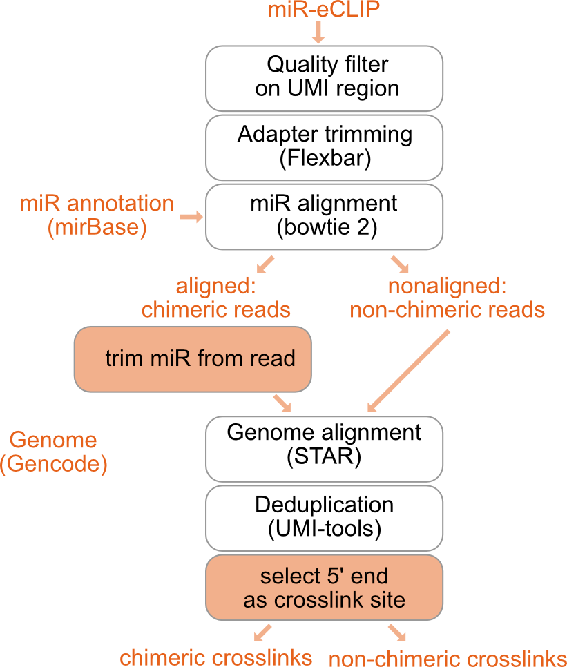

```{r setup, include=FALSE}
require("knitr")
knitr::opts_chunk$set(warning = FALSE, message = FALSE, cache = F, echo = F, cache.lazy = FALSE, dpi = 20, fig.width = 20, fig.height = 10)


source(paste0(params$snake_dir, "/workflow/rules/theme_html.R"))
library(ggplot2)
theme_set(theme_html())

# Get the current library paths
current_lib_paths <- .libPaths()

# Add a new library path
new_lib_path <- "/path/to/new/library"
.libPaths(c(new_lib_path, current_lib_paths))

# require("knitr")
# knitr::opts_chunk$set(warning=FALSE, message=FALSE, cache=T, cache.lazy = FALSE,  dpi= 20, fig.width = 20, fig.height = 10, out.width="100%") 
# tidy.opts=list(width.cutoff=80,tidy=TRUE, echo=FALSE)
# 
# source("/Users/melinaklostermann/Documents/projects/R_general_functions/theme_paper.R")
# library(ggplot2)
# theme_set(theme_paper())


```

```{r libraries, include=FALSE}
library(tidyverse)
library(readr)
library(yaml)
library(GenomicRanges)
library(rtracklayer)


```

# Configurations {.tabset}
```{r}
config_default <- yaml.load_file(paste0(params$snake_dir, "/config/config.yaml")) %>%
  map_dfr(., ~.x) %>%
  t(.) #%>%
  #as.data.frame()
# config <- yaml.load_file(params$config) %>% map_dfr(., ~.x) %>% t(.) %>% as.data.frame(.)
cfg <- params$config %>% unlist()

cfg <- cfg[4:length(cfg)]
cfg <- str_remove_all(cfg, "\\{")
cfg <- str_remove_all(cfg, ",")
cfg <- str_remove_all(cfg, "\\}")
cfg <- str_remove_all(cfg, ":")

n1 <- seq(from = 1, to = length(cfg), by = 2)
n2 <- seq(from = 2, to = length(cfg), by = 2)

config = data.frame("config" = cfg[n2])
rownames(config) = cfg[n1]


colnames(config_default) <- c("config")


n <- which(!(rownames(config_default) %in% rownames(config)))

add <- data.frame(config = config_default[n,])
rownames(add) <- rownames(config_default)[n]


config <- rbind(config, add)
kable(config)

dir <- config["wdir",]
dir <- as.character(dir)
```


## Input files {-}
```{r}
k = config[c("infile", "barcodes_fasta", "gtf", "genome_fasta", "mir_genome_fasta"), ] %>% as.data.frame()
rownames(k) = c("infile", "barcodes_fasta", "gtf", "genome_fasta", "mir_genome_fasta")
kable(k)  
```

## Optional steps {-}
```{r}
k = config[c("demuliplexing", "adapter_cycles", "quality_filter_barcodes"), ] %>%
  as.data.frame()
rownames(k) = c("demuliplexing", "adapter_cycles", "quality_filter_barcodes")
kable(k) 
```

## Barcode settings {-}
```{r}
k = config[c("barcodeLength", "minBaseQuality", "umi1_len", "total_barcode_len", "samples"), ] %>%
  as.data.frame()
rownames(k) = c("barcodeLength", "minBaseQuality", "umi1_len", "total_barcode_len", "samples")
kable(k)  
```

## Read filter {-}
```{r}
k = config[c("flexbar_minReadLength"), ] %>%
  as.data.frame()
rownames(k) = c("flexbar_minReadLength")
kable(k)  
```

## Alignment setting (STAR) {-}
```{r}
k = config[c("sjdbOverhang", "outFilterMismatchNoverReadLmax", "outFilterMismatchNmax", "outFilterMultimapNmax", "alignEndsType",
               "outReadsUnmapped",  "outSJfilterReads"), ] %>%
  as.data.frame()
rownames(k) = c("sjdbOverhang", "outFilterMismatchNoverReadLmax", "outFilterMismatchNmax", "outFilterMultimapNmax", "alignEndsType",
               "outReadsUnmapped",  "outSJfilterReads")
kable(k) 

```

## Experimental groups {-}
```{r}
if (file.exists(config["experiment_group_file",])) {
  # If the file exists, read it
  groups <- read.table(config["experiment_group_file,"])
  colnames(groups) <- c("Group", "Sample")
  kable(groups)  # or do whatever you need with the 'groups' data
} else {
  # If the file does not exist, write a message
  cat("No groups specified. All samples were merged and named all_samples. \n")
}


```

# Overview of steps performed




First quality filtering and adapter trimming is performed on the raw data. A description of these steps can be found in the main report.


## miR alignment

Filtered and trimmed reads are shortend to the first (5') 24nt with fastx_trimmer -l 24 (from FASTX-Toolkit). For chimeric reads, these 24nt include the 21nt long miRNA. This is done to increase the alignability of the reads, as the long reads have sometimes caused problems when aligning to the annotation of the mature miRNA, which contains only short sequences.

The short reads are then aligned to the miR annotation using bowtie2 with the following settings: --local -D 20 -R 3 -L 10 -i S,1,0.50 -k 20 --trim5 2. Before building an index of the miR genome using bowtie2-build. 

## Obtaining separate fastq files of chimeric and non-chimeric reads

The reads in the obtained .sam file are then split into chimeric reads and non-chimeric reads by the sam-FLAG with samtools view -f 0 for chimeric reads and samtools view -f 4 for non-chimeric (unaligned) reads. 

The read IDs of the unaligned reads are used to extract the non-chimeric reads from the quality filtered and trimmed fastq files with seqkit grep -n. The fastq files of the non-chimeric reads are then sorted with seqkit sort -n and afterwards aligned to the genome annotation as described in the main report.

The chimeric reads are further split by the position of their mapping start (4th column in the sam file). It is important to consider the mapping start, as not all miRs start at the first nucleotide of the read, but the crosslink position should be exactly 21nt after the first nucleotide of the miR. Awk on the sam files is used to make a list of read IDs for each mapping start, then the reads are extracted from the quality filtered and trimmed fastq files according to the mapping start with seqkit grep -n. In addition, the name of the miR (column 3 of the sam file) is extracted as a separate list with awk and added to the beginning of the read_id in the fastq files with seqkit replace -p '(.+)' -r "{{kv}}".

For each mapping start position, the long reads in the fastq files are trimmed with fastx-trimmer so that the first nt (5') corresponds to the position where reverse transcription stopped, which is 1nt upstream of the UV crosslink.

After trimming, the fastq files of the chimeric reads are reassembled using cat. By default, reads with a mir start position of 1, 2, 3 or 4 are included and mapping starts at later positions are discarded. This can be changed (see configurations above).

## Alignment of chimeric reads to genome annotation

The genome annotation is indexed using STAR --runMode genomeGenerate. The merged file of chimeric reads is then aligned to the genome annotation using STAR --runMode alignReads. For STAR settings, see Configurations. The resulting bam files are indexed using samtools index.


## Deduplication

Chimeric reads are deduplicated in the same way as non-chimeric reads with umi_tools dedup --extract-umi-method read_id --method unique.

## Obtaining chimeric crosslinks

The deduplicated bam files are then converted to bed files using bedtools bamtobed. The reads are shifted 1nt upstream (5' direction) with bedtools shift -m 1 -p -1, because the UV crosslink should be positioned 1nt before the stop of the non-miR part of the read. Then the read ID (which now also contains the miR name) is truncated to the miR name using awk, the bed file is split into plus and minus strand and the reads are reduced to 1nt crosslinks again using awk.

To allow visualisation in a genome browser, the 1nt crosslink bed file is then also converted into a .bigWig file using bedGraphToBigWig. These bigWig files are then merged with bigWigMerge by the experiment groups specified by the user.

# Chimeric crosslinks obtained

## Chimeric crosslinks per sample

These are the chimeric crosslinks, that were retrieved from each sample:

```{r, read_crosslink_bed}

####################
# Input reads aufter QC
###################
fastqc_report_filtered <- read_delim(paste0(dir,"/results/fastqc/separate_samples/multiqc_data/multiqc_fastqc.txt"), delim="\t")

fastqc_report_filtered <- fastqc_report_filtered %>% arrange(Sample)

# fastqc_report_filtered <- fastqc_report_filtered[,c(1,5)] %>%
#   arrange(Sample)

#####################
# Aligment to miR
####################
# bowtie_numbers_non_chimeric <-  read_delim(paste0(dir,"/results/mir_analysis/aligned_mir/non_chimeric_bowtie_stats.txt"),
#                                            col_names = c("number", "Sample"))
# kable(bowtie_numbers_non_chimeric)

# bowtie_numbers_chimeric <-  read_delim(paste0(dir,"/results/mir_analysis/aligned_mir/chimeric_bowtie_stats.txt"),
#                                        col_names = c("reads_with_miR", "Sample"))
# kable(bowtie_numbers_chimeric)
# 
# 


#####################
# alignemt to genomic reads
####################
star_mir_out <-  list.files(path = paste0(dir,"/results/mir_analysis/aligned_chimeric_bam"), pattern = "*Log.final.out$", recursive = TRUE, full.names = T) %>% 
  map(., ~read_delim(.x, delim="\t", col_names = c("type", "number")))


star_mir_out_names <-  list.files(path = paste0(dir,"/results/mir_analysis/aligned_chimeric_bam"), pattern = "*Log.final.out$", recursive = TRUE) %>%
  stringr::str_remove(pattern = "chimeric_", . ) %>%
  stringr::str_remove(pattern = ".Log.final.out", . )


star_mir_out2 <- star_mir_out %>% map_dfr( ~ data.frame(reads_with_miR = .x[5,]$number,
                                                aligned_to_genome_perc = .x[9,]$number,
                                                aligned_to_genome_n = .x[8,]$number)
                                   )%>%
  mutate(., Sample = star_mir_out_names) %>% 
  arrange(Sample)


##################
# deduplication
#################
dedup_out <-  list.files(path = paste0(dir,"/results/mir_analysis/aligned_chimeric_bam"), pattern = "*out.duprm.log$", recursive = TRUE, full.names = T) %>%
  map(~read_delim(.x, delim="\t", skip = 57, col_names = c("invalue")) %>%
        mutate(measure = substr(invalue, 29, nchar(invalue)) %>% strsplit(., split = ":")) %>%
        rowwise() %>%
        mutate(type = measure[[1]],
               number = measure[[length(measure)]]) %>%
       .[(nrow(.)-5):(nrow(.)-2),]
      ) 

dedup_out_names <-  list.files(path = paste0(dir,"/results/mir_analysis/aligned_chimeric_bam"), pattern = "*out.duprm.log$", recursive = TRUE) %>%
  stringr::str_remove(pattern = "chimeric_", . ) %>%
  stringr::str_remove(pattern = ".Aligned.sortedByCoord.out.duprm.log", . )

dedup_out_2 <- map_dfc(dedup_out, ~.x$number) 

dedup_out_2 <- t(dedup_out_2) %>% as.data.frame() %>%
  mutate(Sample = dedup_out_names) %>% arrange(Sample)

colnames(dedup_out_2) <- c("Reads", "Crosslink events (without PCR duplicates)", "Crosslinked nucleotides", "Mean crosslink events per crosslinked nulecotide", "Sample")

dedup_out_2 <- dedup_out_2 %>% rowwise(.) %>%
  mutate(Duplication = paste0( floor((1-as.numeric(`Crosslink events (without PCR duplicates)`) / as.numeric(Reads))*100), "%" ))

###################
# Summary table
################
table <- cbind(fastqc_report_filtered[,c("Total Sequences")],
               star_mir_out2, 
               dedup_out_2[, c("Duplication", "Crosslink events (without PCR duplicates)", "Crosslinked nucleotides")])

table$reads_with_miR_perc <- ( as.numeric(table$reads_with_miR) / as.numeric(table$`Total Sequences`)) *100

table <- table[,c("Total Sequences", "reads_with_miR_perc", "reads_with_miR", "aligned_to_genome_perc", "aligned_to_genome_n", "Duplication", "Crosslink events (without PCR duplicates)", "Crosslinked nucleotides" )]

rownames(table) <- dedup_out_2$Sample
colnames(table) <- c("Total Sequences after QC", "Reads with miR [%]", "Reads with miR [n]", "Aligned to genome [%]", "Aligned to genome [n]", "Duplication [%]", "Crosslink events (without PCR duplicates)", "Crosslinked nucleotides" )
  
kable(table, format.args = list(big.mark = ",")) 
```

# Detected miRs per sample

```{r}
# get bed files as granges
mir_crosslinks <- list.files(paste0(dir,"/results/mir_analysis/crosslinks"), 
                             pattern = ".Aligned.sortedByCoord.out.duprm.shifted.1nt.*.bed", recursive = TRUE, full.names = T) %>% 
  map(~import.bed(.x, extraCols = c(Name = "character", Score="numeric", Strand="factor")))

# get names of samples
sample_names <- list.files(paste0(dir,"/results/mir_analysis/crosslinks"), 
                             pattern = ".Aligned.sortedByCoord.out.duprm.shifted.1nt.*.bed", recursive = TRUE) %>%
  stringr::str_remove(pattern = "chimeric_", . ) %>%
  stringr::str_remove(pattern = ".Aligned.sortedByCoord.out.duprm.shifted.1nt.*.bed", . ) 

names(mir_crosslinks) <- sample_names

head(mir_crosslinks)

# clean files
mir_crosslinks <- map(mir_crosslinks, ~ as.data.frame(.x) %>%
                        mutate(strand = Strand))

# combine plus and minus strand
sample_names <- unique(unlist(sample_names)) %>% as.list(.)


mir_crosslinks <- map( sample_names , ~bind_rows(mir_crosslinks[grepl(names(mir_crosslinks), pattern = .x)] ))


```

Chimeric reads will belong to several miRs. Here you can see the number of different miRs found in each sample.

```{r}
# summarise number of miRs per sample
detected_mirs <- map(mir_crosslinks, ~.x %>% 
                       group_by(`Name`) %>% 
                       summarise(n = sum(Score), .groups= "keep") )

detected_mirs <- map(detected_mirs, ~arrange(.x, desc(n)))

# number of unique mirs
n_mirs <- map_dbl(detected_mirs, ~ nrow(.x))

table_detected_mirs <- data.frame(sample = unlist(sample_names), n_miRs = n_mirs)

kable(table_detected_mirs)  


```

## Top 10 miRs detected per sample {.tabset}

The plots show the most frequently detected miRs (top 10) in each sample and the number of corresponding reads.

```{r, results='asis', out.width="100%"}
detected_mirs <- map(mir_crosslinks, ~.x %>% 
                       group_by(`Name`) %>% 
                       summarise(n = sum(Score), .groups= "keep") )

detected_mirs <- map(detected_mirs, ~arrange(.x, desc(n)))
                     
detected_mirs_top_10 <- map(detected_mirs, ~.x[1:10,] %>%
                              arrange(., n))


for(i in 1:length(sample_names)){
  
  cat("\n###", sample_names[[i]], "{-}\n") 
  p <- ggplot(detected_mirs_top_10[[i]], aes(x = factor(Name, levels = Name), y = n))+
    geom_col()+
    coord_flip()+
     xlab("")
  print(p)
  cat(" \n")
}


```

##{-}

## Percentage of miRs detected {.tabset}

The plots show the most frequently detected miRs (top 10) in each sample and the percentage of corresponding reads.

```{r, out.width="100%", results='asis'}
n_reads <- map(detected_mirs, ~sum(.x$n))

detected_mirs_top_10 <- map2(detected_mirs_top_10, n_reads, ~.x %>% 
                        mutate(
  percent = n / .y))


plot_list <- map(detected_mirs_top_10, 
     ~ggplot(.x, aes(x = "", y = percent, fill = factor(Name, levels =Name)))+ 
               geom_col() )


for(i in 1:length(plot_list)){
  
  cat("\n###", sample_names[[i]], "{-}\n") 
  print(plot_list[[i]])
  cat(" \n")
}


```
##{-}

# Session info

```{r}

sessionInfo()
```
